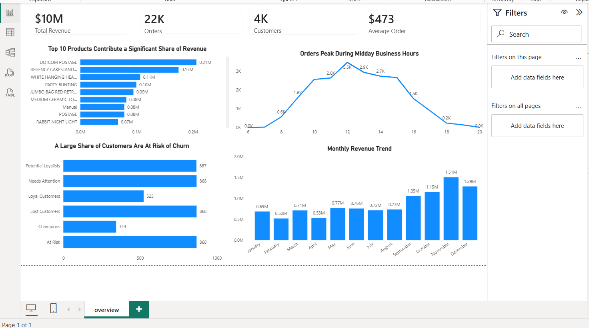

# Retail sales & Customer Segmentation (RFM Analysis) 

---
# 📖 Project Background

A UK-based online retail company specializing in gifts, home décor, stationery, and seasonal products processes thousands of customer transactions every year. While the company collects a large volume of transactional data, Sales and Marketing teams lack a centralized reporting solution to monitor business performance, understand customer purchasing behavior, and identify opportunities to improve customer retention.

This project analyzes historical retail transaction data to transform raw sales records into actionable business insights. By leveraging SQL Server for data preparation and Power BI for interactive visualization, the analysis provides decision-makers with a centralized dashboard to monitor revenue performance, product sales, customer behavior, and customer retention trends.

Insights and recommendations are provided across the following key business areas:

Revenue Performance: Evaluate overall business performance using key metrics such as Total Revenue, Total Orders, Total Customers, and Average Order Value (AOV) while identifying seasonal revenue trends throughout the year.

Product Performance: Identify the products generating the highest revenue and evaluate their contribution to overall business performance to support inventory planning and merchandising decisions.

Customer Purchasing Behavior: Analyze hourly purchasing patterns to understand when customers are most active and identify opportunities to optimize marketing campaigns and operational planning.

Customer Segmentation (RFM Analysis): Classify customers into behavioral segments using Recency, Frequency, and Monetary (RFM) analysis to identify high-value customers, customers requiring engagement, and customers at risk of becoming inactive.

Customer Retention Strategy: Evaluate customer loyalty patterns and identify opportunities to improve repeat purchases through targeted retention initiatives and personalized marketing strategies.

The objective of this project is to provide business stakeholders with a centralized executive dashboard that supports data-driven decision-making, improves customer retention, optimizes inventory planning, and enables sustainable revenue growth.

# 🟨 Data Structure & initial checks

# 🟨 Business Problem

Business stakeholders need a clearer understanding of what drives revenue growth and customer retention. Although the company captures detailed transaction data, it lacks a centralized analytics solution to monitor business performance and identify opportunities for improvement.

Key business questions include:

Which products generate the highest revenue?
How does revenue change throughout the year?
When are customers most likely to make purchases?
Which customer segments contribute the greatest business value?
Which customers require re-engagement to reduce customer attrition?

Answering these questions enables the business to make informed decisions about inventory planning, marketing strategy, and customer retention initiatives, ultimately supporting long-term revenue growth.

---

# 🟨 Methodology

1. Cleaned and transformed raw retail transaction data using **SQL Server**.
2. Built an interactive **Power BI dashboard** to monitor KPIs, revenue trends, product performance, and customer behavior.
3. Performed **RFM Analysis** to segment customers and identify retention opportunities.
4. Translated analytical findings into actionable business recommendations for marketing and management teams.

---

# 🟨 Skills

SQL Server: Views, Data Cleaning, Data Transformation, Joins, Common Table Expressions (CTEs), Aggregate Functions, CASE Statements, Window Functions (NTILE), GROUP BY, Date Functions, RFM Analysis, Business Query Development

Power BI: DAX Measures, Calculated Columns, KPI Cards, Interactive Dashboards, Data Visualization, Time-Based Analysis

Business Analytics: Customer Segmentation (RFM), Revenue Analysis, Product Performance Analysis, Customer Behavior Analysis, Customer Retention Analytics, KPI Reporting, Business Storytelling, Business Recommendations

# 📊 Executive Summary

Overview of Findings
The business generated approximately $10M in revenue from 22K completed orders across 4K customers. Revenue remained relatively stable throughout most of the year before increasing sharply during the fourth quarter, with November generating the highest monthly revenue ($1.51M), highlighting the business's strong dependence on seasonal demand.The analysis identified three key opportunities for improvement. First, revenue is concentrated among a relatively small number of high-performing products, emphasizing the importance of effective inventory management. Second, customer purchasing activity peaks between 10 AM and 2 PM, creating opportunities to improve the timing of marketing campaigns and operational planning. Finally, RFM analysis shows that a significant portion of customers belong to At Risk, Needs Attention, and Lost Customer segments, indicating that strengthening customer retention strategies could have a meaningful impact on long-term revenue growth.

# 🟨 Dashboard

---

# 🟨 Results 

## 📈 Insight 1: Revenue Follows a Strong Seasonal Growth Pattern

 Monthly revenue remained relatively stable between January and August, ranging from $0.52M to $0.77M. Beginning in September, revenue increased by 44% compared to August (from $0.73M to $1.05M) and continued to grow, reaching a peak of $1.51M in November before easing slightly to $1.29M in December.

This historical trend suggests that the business experiences strong seasonal demand during the fourth quarter, with a significant share of annual revenue generated during the holiday shopping period. Because sales accelerate rapidly in Q4, proactive inventory planning, demand forecasting, and early promotional campaigns are essential to maximize revenue and avoid stock shortages during peak demand.

---
## 📦 Product Performance

The revenue analysis shows that sales are concentrated among a relatively small group of products. DOTCOM POSTAGE generated the highest revenue at approximately $206K, followed by REGENCY CAKESTAND 3 TIER ($174K) and WHITE HANGING HEART T-LIGHT HOLDER ($106K). Revenue declines noticeably after the top three products, with the remaining products in the top 20 contributing between $38K and $100K each.

This distribution indicates that the business relies heavily on a limited number of high-performing products to generate revenue. Maintaining inventory availability and visibility for these best-selling products is therefore critical, as stock shortages or supply disruptions could have a disproportionate impact on overall sales. At the same time, lower-performing products present an opportunity for cross-selling, bundling, or promotional campaigns to improve their contribution to total revenue.

## 🛒 Customer Purchasing Behavior

Order volume follows a clear daily purchasing pattern, with activity remaining very low during the early morning before increasing rapidly after 8:00 AM. Orders rise from 570 at 8:00 AM to 2,562 by 10:00 AM, reaching a daily peak of 3,464 orders at 12:00 PM. After midday, purchasing activity gradually declines throughout the afternoon, falling to 1,549 orders by 4:00 PM and dropping sharply after 6:00 PM, with only 18 orders recorded by 8:00 PM.

This historical trend indicates that customers are most active during late morning and lunchtime, suggesting these hours represent the business's highest sales opportunity. Scheduling marketing campaigns, promotional emails, and operational resources before or during this peak period can help maximize customer engagement, improve conversion rates, and ensure sufficient support during the busiest hours of the day.

---

## 👥 Customer Segmentation (RFM Analysis)

RFM (Recency, Frequency, Monetary) analysis classified customers into six behavioral segments based on their purchasing activity. The largest customer groups belong to At Risk (868 customers), Lost Customers (868), Needs Attention (868), and Potential Loyalists (867), while only 344 customers are classified as Champions and 523 as Loyal Customers.

This distribution suggests that a substantial portion of the customer base is either showing signs of declining engagement or has already become inactive, while comparatively fewer customers demonstrate strong purchasing loyalty. Since retaining existing customers is generally more cost-effective than acquiring new ones, improving engagement among these higher-risk segments presents one of the business's greatest opportunities to increase repeat purchases and long-term customer value.

# 💡 Business Recommendations

Based on the analysis, the following recommendations are proposed to improve revenue performance, customer retention, and operational efficiency:

Prioritize customer retention initiatives, as the largest customer segments are At Risk, Lost Customers, and Needs Attention. Implement personalized win-back campaigns, targeted discounts, and loyalty incentives to encourage repeat purchases.

Strengthen loyalty programs by rewarding Champions and Loyal Customers with exclusive offers, early product access, or referral benefits to increase customer lifetime value and maintain long-term engagement.

Increase inventory availability before Q4, as revenue grows significantly during the final quarter and peaks at $1.51M in November. Accurate demand forecasting and proactive stock planning can help prevent stockouts during peak shopping periods.

Focus inventory management on high-performing products, as a relatively small number of products contribute a significant share of total revenue. Maintaining stock availability for these best-selling items can help protect overall sales performance.

Improve the visibility of lower-performing products through product bundles, cross-selling, and targeted promotional campaigns to diversify revenue across a broader product portfolio.

Schedule marketing campaigns during peak purchasing hours (10 AM–2 PM), when customer order activity is highest, to improve campaign effectiveness and increase conversion opportunities.

Use RFM segmentation as an ongoing business strategy by regularly monitoring customer movement between segments and adapting marketing campaigns based on customer purchasing behavior rather than applying the same strategy to all customers.

# 🚀 Future Improvements

This project can be extended further through:

Customer Churn Prediction
Customer Lifetime Value (CLV) Prediction
Sales Forecasting
Cohort Retention Analysis
Market Basket Analysis
Product Profitability Analysis
Geographic Sales Analysis
Automated Data Refresh
Drill-through Dashboard Pages

These enhancements would provide deeper analytical insights and strengthen business decision-making.
